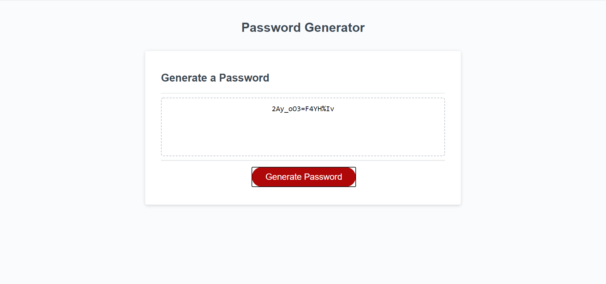

# 03 JavaScript: Password Generator

## What it is:

In this project, we were given some basic starter html, css, and javascript code and asked to code a function that would return a randomized password based on the inputs the user selects from the prompts the site gave them....i.e. length of password, to include numbers, etc.

## What I Did:

```
Here was my thought process on accomplishing this objective:

1. I created variables for each character type "numbers, uppercase letters, lowercase letters, and symbols"
2. Next, I set a variable called randChar to be able to accept all of the random characters the user decided to include
3. Then I set up my prompt and confirms, so that when the program started, the user was asked how many characters they wanted to include, then it cycled through the confirms for the remaining character types
4. I inserted if/else logic with the prompt/confirms so that I would get a valid response, as well as add the confirmed responses to my randChar variable
5. I created a loop so that I could grab characters at random and build out my password
6. Once my password was complete, I passed that into a final password, which is then displayed on the page
```

## Acceptance Criteria I followed

```
GIVEN I need a new, secure password
WHEN I click the button to generate a password
THEN I am presented with a series of prompts for password criteria
WHEN prompted for password criteria
THEN I select which criteria to include in the password
WHEN prompted for the length of the password
THEN I choose a length of at least 8 characters and no more than 128 characters
WHEN prompted for character types to include in the password
THEN I choose lowercase, uppercase, numeric, and/or special characters
WHEN I answer each prompt
THEN my input should be validated and at least one character type should be selected
WHEN all prompts are answered
THEN a password is generated that matches the selected criteria
WHEN the password is generated
THEN the password is either displayed in an alert or written to the page
```

## Website Link/Screenshot



[GitHub Site](https://cloud3118.github.io/homework3-passwordgenerator/)

## Kudos

I want to thank a lot of people this week....

1. ALL the TAs in my Bootcamp course...each added some insight to be able to complete the code.
2. The Bootcamp Spot help line.  They got me unstuck several times.
3. The copious amount of YouTube tutorials I watched and the Stack Overflow answers I dug through.
4. Finally, my tutor Juan Delgado, who really put it all together for me and walked me through where I was confused about what I was doing.

## Final Thoughts

I really enjoyed this project, because it showed that I could build a web application that actually did some work.  I know I have a LONG way to go in my web development journey, but I was glad that I could put it together with the help of everyone mentioned above.  On to the next one.